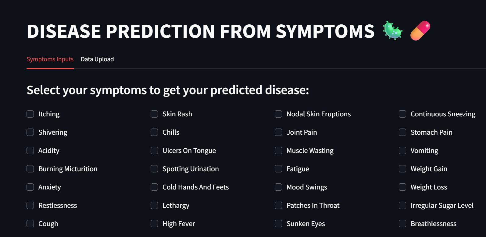
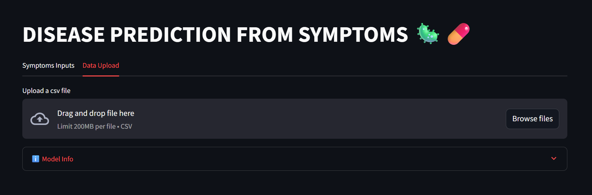

# 🧠 Disease Prediction from Symptoms App
A web-based disease prediction tool built with Streamlit and powered by a Deep Neural Network 
trained on 132 binary symptom features to identify over 40 different diseases. 
This project aims to assist the medical community and individuals by providing quick 
predictions based on selected or uploaded symptom data.

