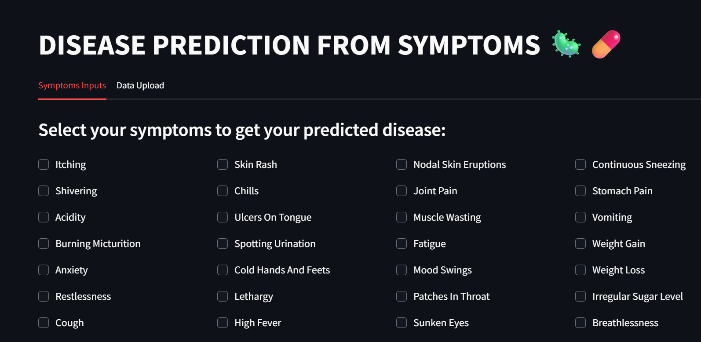
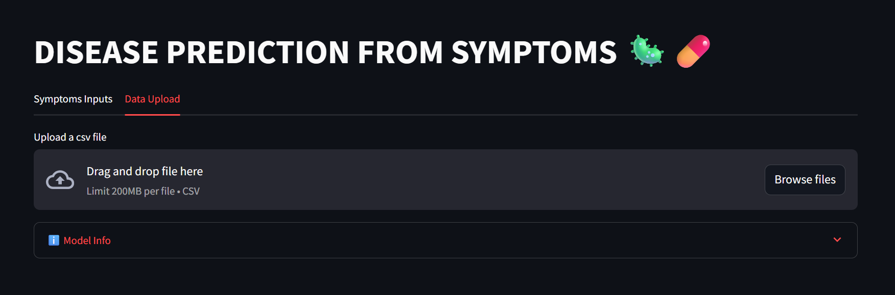

# 🧠 Disease Prediction from Symptoms App
A web-based disease prediction tool built with Streamlit and powered by a Deep Neural Network 
trained on 132 binary symptom features to identify over 40 different diseases. 
This project aims to assist the medical community and individuals by providing quick 
predictions based on selected or uploaded symptom data.

<<<<<<< HEAD
## Run the app locally
1. Activate your Python environment.
2. Install dependencies if needed: `pip install -r requirements.txt`
3. Run the app:
   `streamlit run disease_predictor_app.py`

## Share with testers
- This app is ready for Streamlit Community Cloud deployment.
- A Streamlit config file is included at `.streamlit/config.toml`.
- For local testing, use `streamlit run disease_predictor_app.py` and share your machine's local network URL.

## Review submissions
- The app writes visitor inputs and results to `user_predictions_log.csv`.
- Open the `Admin Dashboard` tab and enter the admin key to review recent submissions.
- Default admin key: `admin123`
- To override the admin key in production, set the environment variable `DISEASE_APP_ADMIN_KEY`.
=======

>>>>>>> 6bd61e3adf299dc0fade93c5aa1a1f66639634b1
